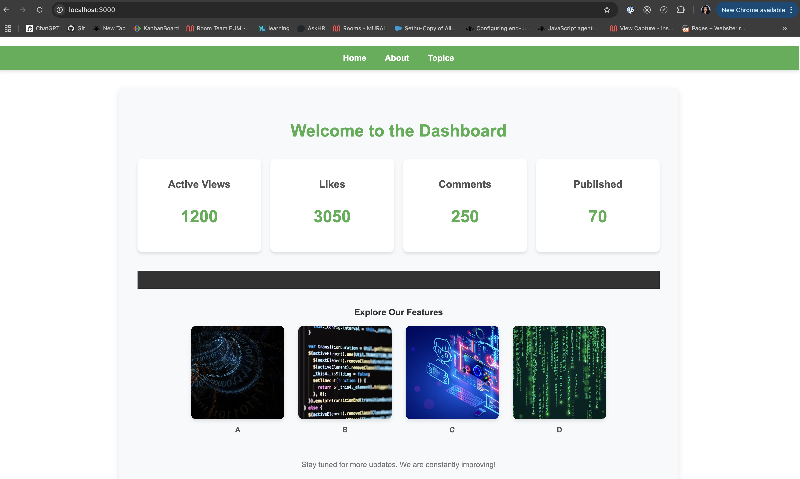
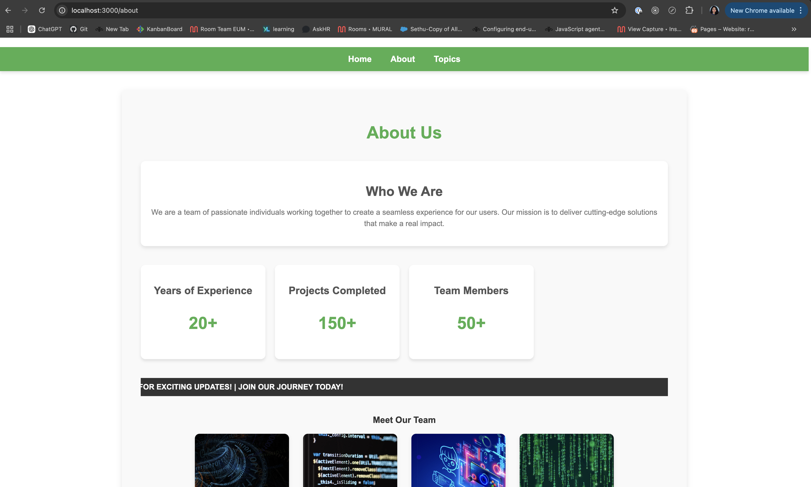
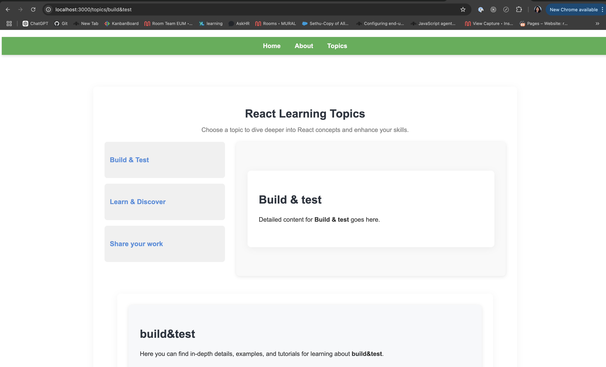
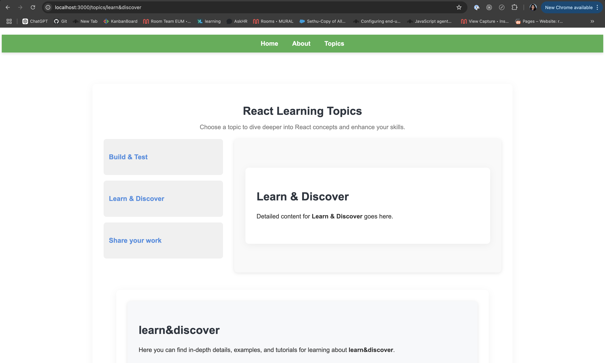
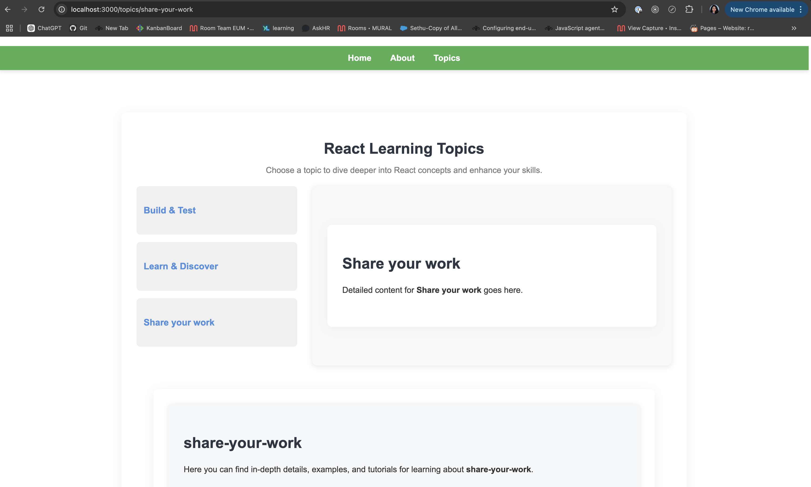

# react-spa-dashboard Example

This example shows how to define pages for websites
making use of React with react-router.
- React SPA - without auto page detection.
- A dynamic React-based single-page application (SPA) featuring a dashboard with key metrics and an interactive learning section. Explore topics on React, view live metrics, and dive deep into concepts. Designed for a smooth user experience, it offers easy navigation and real-time content updates.

## Demo

You can check out the live demo at [DEMO - Click Here.](https://react-spa-dashboard-without-apd.netlify.app/)

## Features

- **Dashboard:** Displays key metrics like active views, likes, comments, and published content.
- **Topics Section:** Explore React learning topics such as "Build & Test", "Learn & Discover", and "Share Your Work".
- **Smooth Navigation:** Single-page app with dynamic routing, providing a seamless experience without page reloads.
- **Scrolling Notes:** A scrolling announcement feature to display real-time updates.

## Installation

### Prerequisites

- [Node.js](https://nodejs.org) (v12 or higher)
- [npm](https://npmjs.com) (comes with Node.js)

### Steps

- **Clone the repository:** git clone https://github.com/sethulakshmi-pm/react-spa-dashboard.git
- **Navigate to the project folder:** cd react-dashboard
- **Install the dependencies:** npm install
- **Start the development server:** npm start
- **Open the app in your browser:** [localhost](http://localhost:3000)

## Where Is The Important Part?

 - The EUM snippet is added to `public/index.html`.
 - The pages are defined in `src/App.js` by making use of a custom history object.

## TLDR

```javascript
const customHistory = createBrowserHistory();

customHistory.listen(location => {
  console.log('Set page to', location.pathname);

  // eslint-disable-next-line no-undef
  ineum('page', location.pathname);

});

…

<Router history={customHistory}>
 …
</Router>
```






